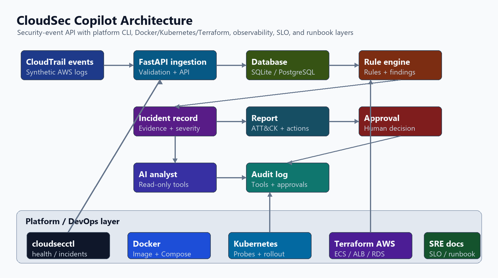
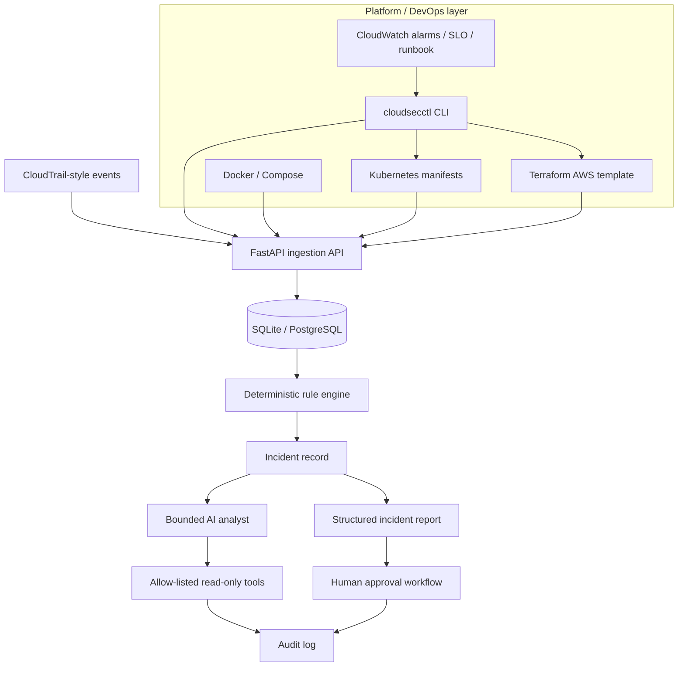
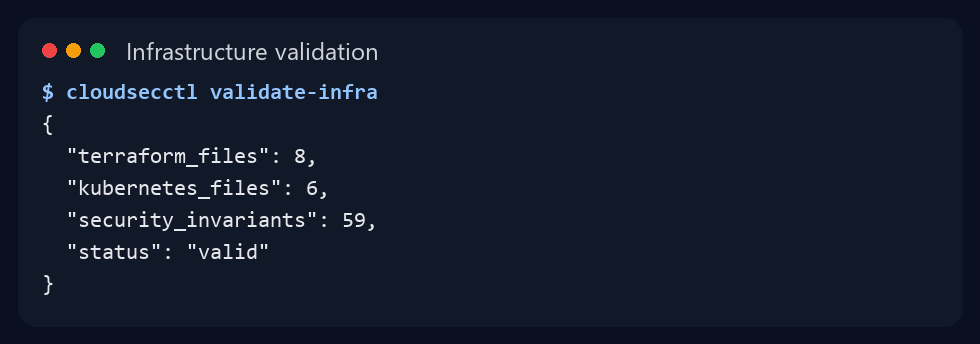
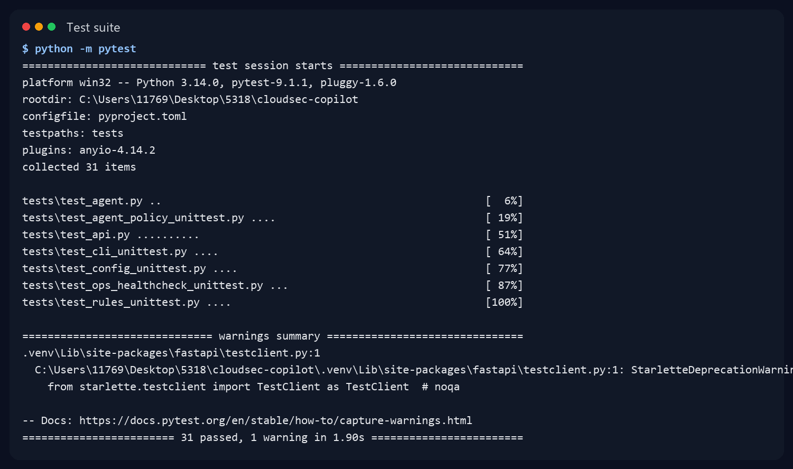
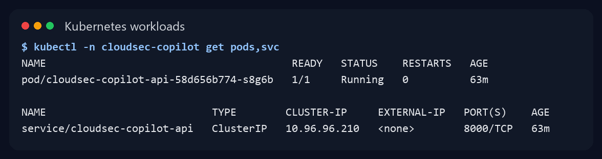

# CloudSec Copilot

CloudSec Copilot is a portfolio project that turns AWS security events into
auditable incident reports. It combines deterministic detection rules with a
tool-using AI analyst, while keeping every high-risk action behind explicit
human approval.

When this repository is pushed to GitHub, add the Actions badge for
`.github/workflows/ci.yml` near the top of this README.

## What this demonstrates

- FastAPI security-event ingestion, deterministic detection rules, and incident
  reporting
- Docker containerization and GitHub Actions test/build workflow
- AWS Terraform template for ECS Fargate, ALB, RDS, ECR, Secrets Manager, IAM,
  CloudWatch logs, and CloudWatch alarms
- `cloudsecctl` platform CLI for health checks, incident listing, infrastructure
  validation, and Kubernetes checks
- Linux operations script, SLO notes, first-response runbook, and Kubernetes
  failure-drill documentation
- Local Kubernetes validation with Docker Desktop and kind

## Problem

Cloud security logs are detailed but time-consuming to investigate. Analysts
need to collect related events, identify the affected identity and resource,
consult response playbooks, and document their conclusions. This project
automates the repetitive parts without allowing the AI layer to make
uncontrolled changes to cloud resources.

## MVP scope

The first usable version will:

1. Import synthetic AWS CloudTrail-style JSON events.
2. Normalize and store the events in PostgreSQL.
3. Detect at least five suspicious event patterns with deterministic rules.
4. Let an AI analyst call allow-listed tools to collect supporting evidence.
5. Retrieve relevant response guidance from a small playbook knowledge base.
6. Produce a structured incident report with severity, confidence, evidence,
   ATT&CK mapping, and recommended actions.
7. Require human approval before any simulated remediation action.
8. Record every analysis, tool call, and approval decision in an audit log.

## Initial detection scenarios

- Root account login without MFA
- CloudTrail logging disabled
- Public S3 bucket configuration
- Risky security-group ingress on port 22 or 3389
- IAM privilege escalation or policy modification
- Repeated failed authentication attempts

## Architecture





Local development can run with FastAPI and SQLite or Docker Compose with
PostgreSQL. The AWS path uses Terraform. The Kubernetes path uses Docker
Desktop with kind/minikube for local platform validation.

## Implemented local API

The current backend includes:

- Idempotent import of CloudTrail-style `Records` envelopes
- Normalized event fields plus retention of the original JSON event
- Event listing and lookup endpoints
- Five deterministic AWS security detection rules
- Idempotent incident creation with evidence and human-approval metadata
- Structured incident reports with MITRE ATT&CK context and response steps
- Optional OpenAI Responses API analyst with two allow-listed read-only tools
- Per-tool-call audit records, bounded agent steps, and incident-scoped access
- One-time human approval or rejection without automatic cloud remediation
- PostgreSQL runtime configuration and temporary SQLite test databases
- `cloudsecctl` CLI for platform-style operational checks
- Zero-dependency operations health-check scripts and first-response runbook
- Kubernetes manifests with ConfigMap, Secret example, Service, Deployment,
  resource limits, and readiness/liveness probes
- SLO and Kubernetes failure-drill notes

## Platform CLI

Install the project in editable mode, then use `cloudsecctl`:

```powershell
.\.venv\Scripts\python.exe -m pip install -e ".[dev]"
cloudsecctl health --expected-environment development
cloudsecctl incidents list --base-url http://localhost:8000
cloudsecctl validate-infra
cloudsecctl k8s-check
cloudsecctl k8s-check --cluster --verbose
```

The CLI wraps the same checks used by scripts and docs, so it works as a small
platform-operations entry point instead of a collection of disconnected commands.

## API Endpoints

| Method | Path | Purpose |
| --- | --- | --- |
| `GET` | `/health` | Service health and environment |
| `POST` | `/api/v1/events/import` | Validate and import a CloudTrail envelope |
| `GET` | `/api/v1/events` | List stored events |
| `GET` | `/api/v1/events/{event_id}` | Retrieve one event |
| `POST` | `/api/v1/events/{event_id}/analyze` | Run deterministic detection |
| `POST` | `/api/v1/events/{event_id}/analyze-all` | Run all detection rules |
| `GET` | `/api/v1/incidents` | List generated incidents |
| `GET` | `/api/v1/incidents/{incident_id}/report` | Build an auditable incident report |
| `POST` | `/api/v1/incidents/{incident_id}/agent-analysis` | Run the bounded AI analyst |
| `GET` | `/api/v1/incidents/{incident_id}/audit` | List agent and approval audit records |
| `POST` | `/api/v1/incidents/{incident_id}/approval` | Approve or reject proposed response work |

## Local development

Python 3.12 or newer is required.

```powershell
python -m venv .venv
.\.venv\Scripts\python.exe -m pip install -e ".[dev]"
.\.venv\Scripts\python.exe -m pytest
.\.venv\Scripts\python.exe -m uvicorn app.main:app --reload
```

The API is available at `http://localhost:8000`, with interactive documentation
at `http://localhost:8000/docs`. Without `DATABASE_URL`, local development uses
`sqlite:///./cloudsec.db`.

Validate the labeled dataset without third-party dependencies:

```powershell
python scripts/validate_dataset.py
```

Run the same style of health check an operator would use during triage:

```powershell
python scripts/ops_healthcheck.py --url http://localhost:8000/health --expected-environment development
```

On Linux hosts or inside a container shell, run the broader operations check:

```sh
APP_URL=http://localhost:8000/health EXPECTED_ENV=development sh scripts/ops_check.sh
```

The same checks are also available through the CLI:

```powershell
cloudsecctl health --expected-environment development
cloudsecctl validate-infra
```

The deterministic API works without an OpenAI key. To enable the optional
agent-analysis endpoint, copy `.env.example` to `.env`, set `OPENAI_API_KEY`,
and load those environment variables before starting the API. The default model
is `gpt-5.6-terra` and can be changed with `OPENAI_MODEL`.

## Agent safety boundary

The model can call only `get_event_context` and `get_incident_report`. Both are
read-only, validate that requested IDs belong to the active incident, and write
their inputs, outputs, and success state to the audit table. Raw log fields are
explicitly marked as untrusted data. The loop stops after `MAX_AGENT_STEPS`
(default 4, hard maximum 8), and no remediation tool is exposed to the model.

Human approval changes only the incident workflow state. Even an approved
decision is reported as `approved_not_executed`; this MVP never changes AWS
resources.

## Docker Compose

Start the API and PostgreSQL together:

```powershell
docker compose up --build
```

The Compose password is intentionally development-only. Production secrets must
come from a managed secret store and must never be committed.

## Kubernetes manifests

[`k8s/base`](k8s/base) contains local Kubernetes manifests for kind/minikube:
Namespace, ConfigMap, Secret example, Deployment, Service, resource
requests/limits, a non-root pod security context, and `/health` readiness and
liveness probes. See [`docs/kubernetes.md`](docs/kubernetes.md) for deployment
and troubleshooting commands.

Local kind validation has been completed:

```powershell
docker build --tag cloudsec-copilot:dev .
kind load docker-image cloudsec-copilot:dev --name cloudsec
kubectl apply -k k8s/base
kubectl -n cloudsec-copilot rollout status deployment/cloudsec-copilot-api
cloudsecctl health --url http://localhost:8000/health --expected-environment kubernetes-local
```

Failure drills are documented in [`docs/k8s-failure-drill.md`](docs/k8s-failure-drill.md).

## Evidence screenshots

These screenshots are generated from the current local project state with
`scripts/generate_readme_assets.py`.







## SLO and operations docs

- [`docs/slo.md`](docs/slo.md): availability target, latency target, error
  budget, and triage mapping.
- [`docs/deployment.md`](docs/deployment.md): local, Docker Compose,
  Kubernetes, AWS Terraform deployment and rollback steps.
- [`docs/configuration.md`](docs/configuration.md): environment variables,
  secrets, ConfigMap/Secret, Compose, and Terraform configuration management.
- [`docs/observability.md`](docs/observability.md): latency, traffic, errors,
  saturation, CloudWatch, and Kubernetes signals.
- [`docs/runbook.md`](docs/runbook.md): ALB 5XX, ECS task down, RDS connection
  failure, evidence capture, and escalation boundary.
- [`docs/kubernetes.md`](docs/kubernetes.md): kind/minikube deployment and
  kubectl troubleshooting commands.
- [`docs/k8s-failure-drill.md`](docs/k8s-failure-drill.md): ImagePullBackOff,
  probe failure, config missing, and service access drills.
- [`CHANGELOG.md`](CHANGELOG.md): release-style project history.

## Continuous integration

`.github/workflows/ci.yml` installs the project on Python 3.12, validates all
labeled events, checks infrastructure security and monitoring invariants, runs
the full test suite, compiles the source tree, and builds the production
container. It uses read-only repository permissions and never receives an
OpenAI API key; the Agent loop is tested with a deterministic fake client
instead of making paid external calls.

## AWS deployment template

[`infra/terraform`](infra/terraform) contains a cost-aware ECS Fargate, ALB,
private RDS PostgreSQL, ECR, Secrets Manager, IAM, and CloudWatch deployment.
Database credentials are generated and managed by RDS instead of entering
Terraform variables. The OpenAI key is optional and referenced only by the ARN
of a separately created secret. See the infrastructure README for the two-stage
image bootstrap, cost warning, TLS option, CloudWatch alarm outputs, and
teardown procedure. [`docs/runbook.md`](docs/runbook.md) documents first-pass
triage for ALB 5XX errors, ECS task failures, and RDS connection issues.

## Security principles

- Deterministic rules remain the source of truth for the initial detections.
- AI tools are allow-listed and validated with strict input schemas.
- Log content is treated as untrusted data, never as instructions.
- Conclusions must reference stored evidence.
- Tool calls and approval decisions are auditable.
- High-risk actions require human approval and are simulated in the MVP.
- Secrets are never committed to the repository.

## Milestones

- [x] Define project goal, MVP boundary, and security principles.
- [x] Create and label synthetic CloudTrail-style events.
- [ ] Build and verify the FastAPI ingestion endpoint and PostgreSQL schema.
- [x] Implement and verify the first rule: root login without MFA.
- [x] Expand to five labeled AWS security detection rules.
- [x] Generate evidence-backed incident reports with ATT&CK mappings.
- [ ] Run automated tests for ingestion and detection.
- [x] Add bounded AI analyst tools and per-call audit records.
- [x] Add a one-time human approval/rejection workflow.
- [ ] Add playbook retrieval and evaluation.
- [x] Add operations health-check scripts, CloudWatch alarms, and runbook.
- [x] Add Kubernetes manifests and kubectl troubleshooting notes.
- [x] Add `cloudsecctl` platform CLI.
- [x] Add SLO and Kubernetes failure-drill documentation.
- [x] Add deployment, configuration, observability, changelog, and Mermaid
  architecture docs.
- [ ] Containerize and deploy to AWS with Terraform and CI/CD.
- [ ] Publish architecture, results, and a short demonstration video.

## MVP completion criteria

The MVP is complete when it can be started from a clean environment, import a
labeled event set, detect the supported scenarios, generate evidence-backed
reports, pass automated tests, and show evaluation results without performing
unapproved cloud actions.

## Current status

The ingestion API, database models, five detection rules, incident persistence,
structured reports, bounded AI analyst, audit trail, approval workflow, Docker
configuration, CI, AWS Terraform template, CloudWatch alarms, operations
health-check scripts, Kubernetes manifests, runbook, and API tests are
implemented. All five rules have been verified against 18 labeled events; Agent
policy and infrastructure security/monitoring/Kubernetes invariants also have
dependency-free tests. The Kubernetes manifests have also been validated locally
with Docker Desktop and kind. Full PostgreSQL, Terraform-provider, live-model,
and AWS integration tests remain pending until the required runtime environment
is available. No AWS resources have been created by this repository.
